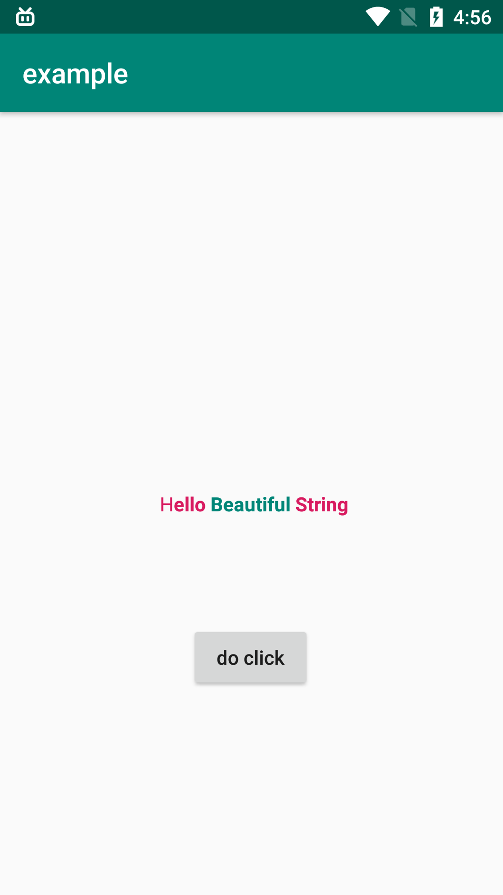

# Beautiful String
This is the build class for SpannableString



# example
```
 SpannableString ss = BeautifulString.get(textView)
                .style(android.graphics.Typeface.BOLD, 2, BeautifulString.MAX_LENGTH, true)
                .append(" Hello")
                .color(R.color.colorAccent)
                .append(" Beautiful")
                .color(R.color.colorPrimary)
                .append(" String")
                .onClick(new View.OnClickListener() {
                    @Override
                    public void onClick(View v) {
                        Toast.makeText(MainActivity.this,"click",Toast.LENGTH_SHORT).show();
                    }
                })
                .color(R.color.colorPrimary)
                .build();

        textView.setText(ss);
```